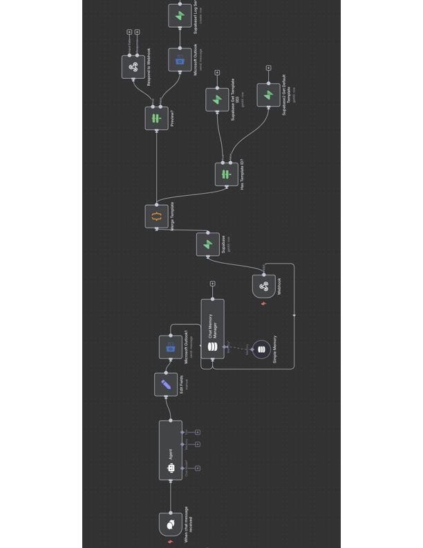
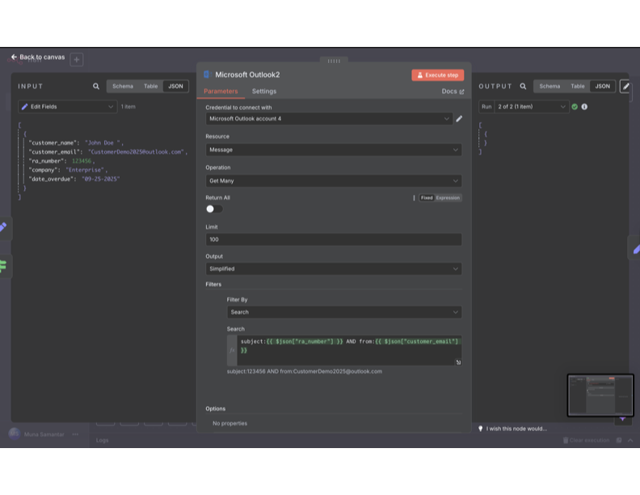
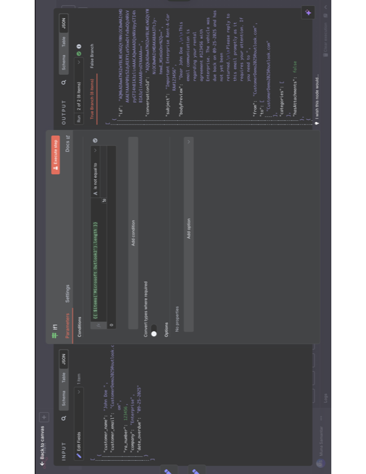
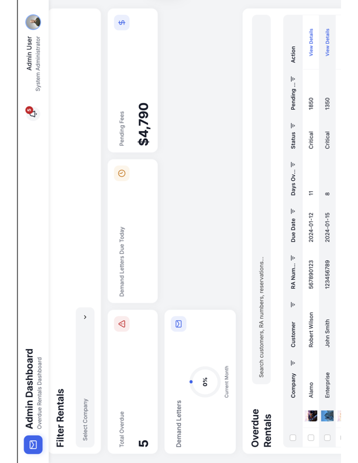
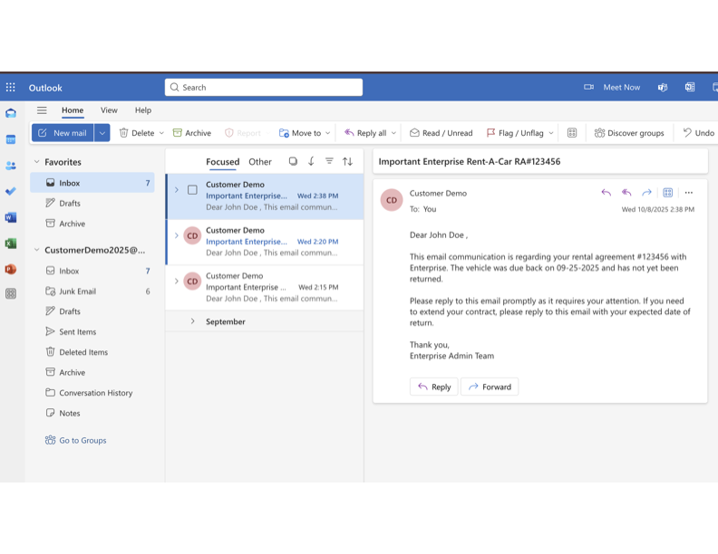

#  Overdue Rental Automation System
### n8n AI Agent | Enterprise Rent-A-Car (Pilot Project)
 
An end-to-end automation workflow built to eliminate manual overdue customer follow-up emails at a multi-brand car rental branch. Designed, built, and tested independently as an operational improvement initiative while working as an Administrative Assistant at Enterprise Holdings / Signature Aviation.
 
---
 
##  Problem
 
The branch admin team manually tracked and sent overdue rental reminder emails across **Enterprise, National, and Alamo** customers daily. This process:
 
- Consumed significant staff time on repetitive, low-value tasks
- Increased the risk of missed follow-ups or missed CCs
- Provided no visibility into response rates, conversion rates, or branch performance metrics
 
---
 
##  Solution
 
An **n8n-based AI agent** connected to Microsoft Outlook, Supabase, and a custom Admin Dashboard that:
 
- Automatically generates personalized overdue reminder emails using customer data
- Sends emails through Microsoft Outlook with dynamic fields (customer name, RA number, company, due date)
- Logs every email sent, response received, and conversion outcome to Google Sheets / Supabase
- Tracks monthly metrics: conversion rate, pending fee percentage, and response rate
- Surfaces all data in a real-time Admin Dashboard with filtering by company (Enterprise / National / Alamo)
 
---
 
## Architecture
 
### Full AI Agent Workflow

 
The complete workflow includes:
- **Chat Message Trigger** → AI Agent with memory
- **Edit Fields** → Microsoft Outlook (send personalized email)
- **Chat Memory Manager** + **Simple Memory** (context retention)
- **Webhook** → **Supabase** (data retrieval)
- **Template Logic** (Has Template ID? → Supabase Get Template or Default Template)
- **Merge Template** → **Preview Gate** → Send or Respond to Webhook
- **Supabase Log** (records outcome)
 
### Outlook Integration (JSON Data Mapping)

 
### Conditional Logic (IF Node)

 
Dynamic fields mapped from customer data:
```json
{
  "customer_name": "John Doe",
  "customer_email": "CustomerDemo2025@outlook.com",
  "ra_number": 123456,
  "company": "Enterprise",
  "date_overdue": "09-25-2025"
}
```
 
---
 
##  Admin Dashboard
 
### Dashboard View

 
The dashboard provides branch admins with:
 
| Feature | Description |
|---|---|
| **Total Overdue** | Live count of overdue rentals |
| **Pending Fees** | Total outstanding balance (e.g. $4,790) |
| **Demand Letters** | Monthly send rate and conversion % |
| **Overdue Rentals Table** | Filterable by Company, Status (Critical/High/Medium/Low), Days Overdue |
| **Customer Detail View** | Expandable record per customer with RA number, due date, and pending amount |
 
---
 
## Email Output
 
### Automated Email (Outlook)

 
Each email is fully personalized:
> *"Dear [Customer Name], This email communication is regarding your rental agreement #[RA Number] with [Company]. The vehicle was due back on [Date] and has not yet been returned..."*
 
---
 
##  Results (Testing Phase)
 
| Metric | Result |
|---|---|
| Reduction in manual email volume | **80%** |
| Time saved per day | **1.6 hours** |
| Brands supported | Enterprise, National, Alamo |
| Workflow nodes | 15+ |
| Integrations | Microsoft Outlook, Supabase, Google Sheets, Webhook |
 
---
 
##  Tech Stack
 
| Tool | Purpose |
|---|---|
| **n8n** | Workflow automation engine |
| **Microsoft Outlook** | Email delivery |
| **Supabase** | Database (customer records, email templates) |
| **Google Sheets** | Logging and reporting |
| **Bubble.io** | Admin Dashboard UI |
| **Webhook** | Trigger and response handling |
 
---
 
##  Repo Structure
 
```
overdue-rental-automation/
├── README.md
├── screenshots/
│   ├── workflow-overview.png
│   ├── outlook-integration.png
│   ├── dashboard.png
│   └── email-output.png
└── docs/
    └── pilot-proposal.pdf
```
 
---
 
##  About
 
Built by **Muna Samantar**
- B.S. Information Technology, George Washington University ('26) — GPA 4.0
- AWS Cloud Practitioner
- NeuralSeek/IBM: AI Agent Foundations & AI Agentic for Businesses
- Former AI/Automation Engineering Intern @ NeuralSeek
 
 Munas@gwu.edu |  Northern Virginia
